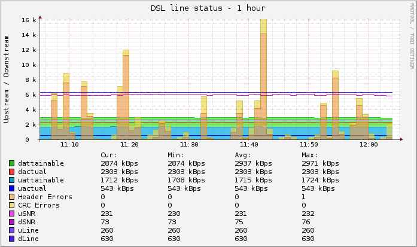
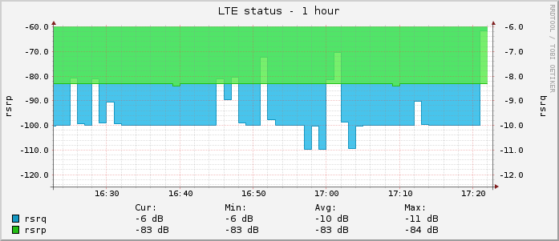

### speedport php api

[](https://travis-ci.org/Stricted/speedport-hybrid-php-api) [](https://github.com/Stricted/speedport-hybrid-php-api/releases/latest) [](https://github.com/Stricted/speedport-hybrid-php-api/blob/master/LICENSE)

Access Speedport Router through PHP

This is an **EXPERIMENTAL** branch to support other speedport router, i dont have them so feel free to test it and report any error

### License
---
This project is licensed under [GNU LESSER GENERAL PUBLIC LICENSE Version 3](https://github.com/Stricted/speedport-hybrid-php-api/blob/master/LICENSE).

known endpoints for getData() and sentRequest() (only for `Speedport Hybrid`):

| Endpoint       |
| -------------- |
| dsl            |
| interfaces     |
| arp            |
| session        |
| dhcp_client    |
| dhcp_server    |
| ipv6           |
| dns            |
| routing        |
| igmp_proxy     |
| igmp_snooping  |
| wlan           |
| module         |
| memory         |
| speed          |
| webdav         |
| bonding_client |
| bonding_tunnel |
| filterlist     |
| bonding_tr181  |
| lteinfo        |
| status         |
| Connect        |
| WLANBasic      |
| WLANAccess     |
| LAN            |
| NASLight       |
| INetIP         |
| FilterAndTime  |
| Portforwarding |
| PhoneBook      |
| PhoneCalls     |
| SystemMessages |
| DynDNS         |
| Overview       |

PHP requirements
============= 
 * PHP >= 5.4.0
 * PHP extension `hash`
 * PHP extension `curl`
 * PHP extension `json`
 * PHP extension `pcre`
 * PHP extension `ctype`
 * PHP extension `rrd` (optional, for rrd graphs)

rrdtool integration
=============




See the ```rrd``` directory for sample scripts.